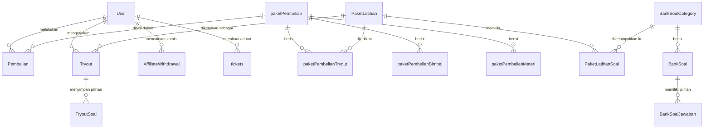

# TemanASN - Sistem Informasi & Platform Belajar Mandiri

Selamat datang di repositori proyek **TemanASN** (meraihNIP). Dokumentasi ini memberikan gambaran arsitektur sistem, pembagian fitur utama, serta korelasi erat antara fitur aplikasi dengan tabel di database (menggunakan Prisma ORM & MySQL).

---

## 🛠️ Ringkasan Arsitektur Database

Aplikasi menggunakan **Prisma client** untuk pemetaan Object-Relational (ORM) dengan basis data **MySQL**. Seluruh data dimodelkan di dalam file `src/database/schema.prisma`.

---

## 📋 Korelasi Fitur & Pemetaan Tabel Database

Berikut adalah daftar modul fitur utama aplikasi TemanASN beserta korelasi tabel databasenya:

### 1. Manajemen Pengguna & Hak Akses
Mengelola data profil pengguna, pembagian hak akses (Role), serta autentikasi keamanan.
* **Tabel Utama:** `User`
* **Korelasi & Detail:**
  * Menyimpan email, password, nomor WhatsApp (`noWA`), jenis kelamin, alamat lengkap, dan foto profil.
  * Kolom `role` menentukan hak akses user (`USER` vs `ADMIN`).
  * Menyimpan saldo dan status program kemitraan (`affiliateBalance`, `affiliateCode`, `affiliateStatus`).

---

### 2. Paket Pembelian & Konten Belajar (Materi, Bimbel, & Tryout)
Menyediakan berbagai paket belajar berbayar yang berisi materi teks, bimbingan online (Bimbel), dan paket latihan ujian.
* **Tabel Utama:** `paketPembelian`
* **Tabel Pendukung:** 
  * `paketPembelianCategory` (Kategori paket)
  * `paketPembelianFitur` (Daftar fitur/keunggulan paket)
  * `paketPembelianMateri` (Akses modul materi & link file)
  * `paketPembelianBimbel` (Akses kelas bimbingan belajar, jadwal mentor, rekaman video)
  * `paketPembelianTryout` (Tryout yang disertakan di dalam paket)
* **Korelasi:**
  * `paketPembelian` memiliki hubungan *one-to-many* ke tabel pendukung di atas.
  * Relasi ke `PaketLatihan` menghubungkan paket dengan konten ujian tryout yang sesungguhnya.

---

### 3. Modul Ujian & Uji Coba (Tryout)
Jantung platform belajar yang memfasilitasi ujian CAT (Computer Assisted Test) simulasi seleksi ASN.
* **Tabel Konten Soal:**
  * `BankSoalParentCategory` & `BankSoalCategory` (Kategori rumpun soal seperti TWK, TIU, TKP)
  * `BankSoal` (Menyimpan narasi soal, pembahasan, dan subkategori)
  * `BankSoalJawaban` (Menyimpan pilihan ganda, kebenaran jawaban `isCorrect`, dan skor point per pilihan)
* **Tabel Paket Latihan:**
  * `PaketLatihan` (Nama ujian, waktu/durasi pengerjaan, KKM kelulusan)
  * `PaketLatihanSoal` (Junction table pembuat paket soal dari Bank Soal)
* **Tabel Hasil Ujian User:**
  * `Tryout` (Log pengerjaan oleh user, total poin, status kelulusan KKM, dan waktu selesai)
  * `TryoutSoal` (Menyimpan snapshot soal dan jawaban yang dipilih user saat ujian berlangsung untuk kebutuhan review/pembahasan)

---

### 4. Sistem Transaksi Pembayaran & Voucher Diskon
Menangani alur pembelian paket belajar, penagihan, kode promo diskon, serta integrasi status pembayaran.
* **Tabel Utama:** `Pembelian` (Invoice, metode pembayaran, total bayar, status transaksi `PAID`/`UNPAID`/`EXPIRED`)
* **Tabel Voucher:** 
  * `Voucher` (Kode promo, tipe potongan persen/nominal, dan status aktif)
  * `VoucherProduct` (Menentukan voucher mana saja yang bisa digunakan untuk suatu `paketPembelian`)
* **Korelasi:**
  * `Pembelian` menghubungkan `User` dengan `paketPembelian` yang dibeli.
  * `Pembelian` juga mencatat detail komisi afiliasi jika transaksi direferensikan oleh pengguna lain.

---

### 5. Program Kemitraan (Affiliate System)
Sistem bagi hasil/komisi ketika user membagikan kode referral dan mendatangkan pembeli baru.
* **Tabel Utama:** `AffiliateWithdrawal` (Log pencairan saldo komisi afiliasi)
* **Korelasi:**
  * `User` menyimpan saldo afiliasi (`affiliateBalance`) dan kode referral unik (`affiliateCode`).
  * Ketika transaksi `Pembelian` berstatus `PAID` menggunakan kode afiliasi, saldo pemilik kode bertambah dan tercatat di kolom komisi `Pembelian`.
  * `AffiliateWithdrawal` mencatat status penarikan dana (`pending`, `approved`, `rejected`) ke rekening tujuan.

---

### 6. Fitur Pembuatan Soal Mandiri (Generate Soal)
Fitur interaktif bagi pengguna untuk membuat kuis mini secara instan berdasarkan parameter jumlah soal, tingkat kesulitan, dan kategori yang diinginkan.
* **Tabel Pendukung:** 
  * `ParentGenerateSoalCategory`
  * `GenerateSoalCategory`
  * `SoalGenerateSoal` (Bank soal khusus generator kuis)
  * `GenerateSoalHistory` (Riwayat kuis yang digenerate user)
  * `GenerateSoalHistoryDetail` (Detail log jawaban user pada kuis mandiri)

---

### 7. Layanan Bantuan & Pengaduan (Support Tickets)
Sistem bantuan pelanggan untuk mempermudah komunikasi kendala teknis antara pengguna dengan Admin.
* **Tabel Utama:** `tickets` (Tiket bantuan, judul kendala, deskripsi, gambar lampiran, status `open`/`closed`)
* **Tabel Percakapan:** `ChatTicket` (Log chat balasan real-time antara Admin dan User di dalam tiket tersebut)

---

### 8. Notifikasi & Pengumuman
Menyampaikan pengumuman admin maupun notifikasi transaksi otomatis kepada user.
* **Tabel Utama:** 
  * `DashboardNotification` (Pengumuman publik di dashboard admin/user)
  * `Notification` (Definisi pesan notifikasi sistem)
  * `NotificationUser` (Junction table notifikasi spesifik per user beserta status `isRead`)

---

### 9. Testimoni, FAQ, dan Fitur Tambahan
* **Testimoni & Feedback:** `Testimoni` (tampilan landing page) dan `Feedback` (saran internal user setelah memakai platform).
* **FAQ Chatbot:** `FaqChatbot` (Data tanya-jawab chatbot otomatis di pojok layar).
* **Kalender Event:** `KalenderEvent` (Jadwal event tryout massal atau agenda bimbel).
* **Berita:** `Berita` (Blog/artikel informasi terkini seleksi ASN).
* **Sidebar Settings:** `SidebarMenu` (Konfigurasi dinamis tampilan menu di sidebar Admin & User).

---

## 📈 Alur Relasi Utama (Skema Ringkas)



---

## 🚀 Cara Menjalankan Project Secara Lokal

### Backend (temanasn-be)
1. Buka folder backend: `cd temanasn-be`
2. Konfigurasi `.env` sesuai `.env.example` (terutama `DATABASE_URL` MySQL).
3. Install dependensi & jalankan server development:
   ```bash
   yarn install
   yarn dev
   ```

### Frontend (temanasn-fe)
1. Buka folder frontend: `cd temanasn-fe`
2. Install dependensi & jalankan server development:
   ```bash
   yarn install
   yarn dev
   ```
3. Untuk build produksi:
   ```bash
   yarn build
   ```
